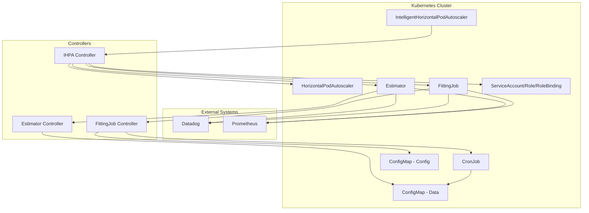

# 設計書

## 概要

Intelligent HPA (IHPA) は、Kubernetesクラスタにおいて機械学習による時系列予測を活用してプロアクティブなオートスケーリングを実現するカスタムコントローラーです。従来のHorizontal Pod Autoscaler (HPA) がリアクティブなスケーリングを行うのに対し、IHPAは将来のメトリクス値を予測して事前にスケーリングを実行します。

システムは3つの主要なカスタムリソース（IHPA、FittingJob、Estimator）と、それらを管理するコントローラーから構成されます。Prophet時系列予測ライブラリとSingular Spectrum Transformation（SST）による変化点検知を組み合わせて、高精度な予測を実現します。

## アーキテクチャ

### システム全体アーキテクチャ



### コンポーネント間の相互作用

1. **IHPA Controller**: IHPAリソースを監視し、HPA、FittingJob、Estimatorリソースを生成・管理
2. **FittingJob Controller**: FittingJobリソースを監視し、CronJobと設定用ConfigMapを管理
3. **Estimator Controller**: Estimatorリソースを監視し、予測データ用ConfigMapを管理し、メトリクス送信を実行

## コンポーネントとインターフェース

### IntelligentHorizontalPodAutoscaler (IHPA)

IHPAは最上位のカスタムリソースで、ユーザーが予測ベースのオートスケーリングを設定するためのインターフェースです。

**主要フィールド:**
- `template`: HPA設定のテンプレート（ExtendedHorizontalPodAutoscalerSpec）
- `estimator`: Estimatorの設定（EstimatorPatchSpec）
- `metricProvider`: メトリクスプロバイダの設定（MetricProvider）

**拡張されたメトリクス仕様:**
- 標準のHPAメトリクス仕様に加えて、`fittingJob`フィールドを追加
- 各メトリクスに対して個別の予測設定が可能

### FittingJob

FittingJobは機械学習モデルの訓練と予測を実行するリソースです。

**主要機能:**
- Prophet時系列予測モデルの訓練
- 変化点検知による訓練データの品質向上
- 予測結果のConfigMapへの保存
- CronJobによる定期実行

**設定パラメータ:**
- `seasonality`: 季節性の設定（auto, daily, weekly, yearly）
- `executeOn`: 実行時刻の設定
- `changePointDetectionConfig`: 変化点検知のパラメータ
- `customConfig`: カスタム設定文字列

### Estimator

Estimatorは予測データを受け取り、適切なタイミングでメトリクスプロバイダに送信するリソースです。

**主要機能:**
- ConfigMapの監視と予測データの読み込み
- 予測値の調整（adjustモード）
- メトリクスプロバイダへの送信
- タイムスタンプの調整（gapMinutes）

**調整メカニズム:**
- 過去の予測精度に基づく動的調整
- yhat_upperを上限とした調整範囲の制限
- プロアクティブスケーリングを維持するための上方向のみの調整

## データモデル

### 予測データフォーマット

予測結果はCSV形式でConfigMapに保存されます：

```csv
timestamp,yhat,yhat_upper,yhat_lower
1582253873,176.89,244.83,50.89
1582253933,126.80,251.26,8.17
1582253993,134.48,268.67,75.97
```

**フィールド説明:**
- `timestamp`: Unix時間（秒）
- `yhat`: 予測値
- `yhat_upper`: 予測値の上限（90th percentile）
- `yhat_lower`: 予測値の下限（10th percentile）

### メトリクス命名規則

**予測メトリクス:**
- プレフィックス: `ake.ihpa.forecasted_`
- Resource メトリクス: `ake.ihpa.forecasted_kubernetes_cpu_usage_total`
- External メトリクス: `ake.ihpa.forecasted_<original_metric_name>`

**集約方式:**
- 訓練データ取得: `sum:` aggregatorを使用
- 予測メトリクス送信: aggregatorなしで送信

## 正確性プロパティ

*プロパティとは、システムのすべての有効な実行において真であるべき特性や動作のことです。本質的には、システムが何をすべきかについての形式的な記述です。プロパティは、人間が読める仕様と機械で検証可能な正確性保証の橋渡しとなります。*

### プロパティ 1: IHPAリソースライフサイクル管理
*任意の* IHPAリソース作成に対して、システムは対応するHPA、FittingJob、Estimatorリソースを正しい仕様とアノテーションで生成すべきである
**検証対象: 要件 1.1, 1.4**

### プロパティ 2: リソース更新の伝播
*任意の* IHPAリソース更新に対して、関連するすべての子リソースは変更を適切に反映すべきである
**検証対象: 要件 1.2**

### プロパティ 3: 削除時のリソースクリーンアップ
*任意の* IHPAリソース削除に対して、関連するすべての子リソースは完全にクリーンアップされるべきである
**検証対象: 要件 1.3**

### プロパティ 4: 複数メトリクスサポート
*任意の* 複数メトリクスを持つIHPAリソースに対して、各メトリクスに対して個別のFittingJobとEstimatorリソースが作成されるべきである
**検証対象: 要件 1.5**

### プロパティ 5: Prophetモデル訓練
*任意の* 十分な履歴データを持つFittingJobに対して、Prophetモデルが正常に訓練され予測メトリクスを生成すべきである
**検証対象: 要件 2.1, 2.2**

### プロパティ 6: 予測出力フォーマット
*任意の* 完了したFittingJob実行に対して、予測結果はtimestamp、yhat、yhat_upper、yhat_lowerカラムを持つCSV形式で保存されるべきである
**検証対象: 要件 2.3**

### プロパティ 7: メトリクス配信タイミング
*任意の* 利用可能な予測データに対して、EstimatorはgapMinutes設定に基づいて正しいタイムスタンプでMetricProviderに予測メトリクスを送信すべきである
**検証対象: 要件 2.4, 8.1**

### プロパティ 8: メトリクスタイプサポート
*任意の* ResourceまたはExternalメトリクスタイプを持つIHPAリソースに対して、両方のタイプで予測が正しく動作すべきである
**検証対象: 要件 2.5**

### プロパティ 9: 変化点検知
*任意の* 変化点検知が有効なFittingJobに対して、SSTアルゴリズムが異常期間を特定し、設定された閾値に基づいて訓練データから除外すべきである
**検証対象: 要件 3.1, 3.2**

### プロパティ 10: 変化点検知フォールバック
*任意の* 変化点検知によってデータが過度に削除されるシナリオに対して、元のデータが訓練に使用されるべきである
**検証対象: 要件 3.3**

### プロパティ 11: メトリクス調整メカニズム
*任意の* 調整モードのEstimatorに対して、最近の予測と実際の値が比較され、調整比率が計算されyhat_upper境界内で適用されるべきである
**検証対象: 要件 4.1, 4.2, 4.3**

### プロパティ 12: 調整モードサポート
*任意の* Estimator設定に対して、「raw」と「adjust」の両方のモードが期待通りに異なる動作をすべきである
**検証対象: 要件 4.4**

### プロパティ 13: 上方向のみの調整
*任意の* 下方向調整となる調整計算に対して、プロアクティブスケーリング動作を維持するためにシステムは適用すべきでない
**検証対象: 要件 4.5**

### プロパティ 14: Datadog統合
*任意の* Datadogプロバイダを持つシステム設定に対して、適切な認証と命名規則でメトリクスが正常に取得・送信されるべきである
**検証対象: 要件 5.1, 5.2, 5.4**

### プロパティ 15: メトリクス集約
*任意の* 履歴データ取得操作に対して、システムは適切な集約（訓練データ用のsum）を適用すべきである
**検証対象: 要件 5.3**

### プロパティ 16: CronJobスケジューリング
*任意の* 指定されたexecuteOn時刻を持つFittingJobに対して、正しいスケジュール（指定時刻のランダム分）でCronJobが作成されるべきである
**検証対象: 要件 6.1, 6.2**

### プロパティ 17: データ充足性チェック
*任意の* 不十分な履歴データでのFittingJob実行に対して、適切なログ記録とともに予測がスキップされるべきである
**検証対象: 要件 6.4**

### プロパティ 18: RBACリソース作成
*任意の* IHPAリソース作成に対して、正しい権限を持つ適切なServiceAccount、Role、RoleBindingリソースが作成されるべきである
**検証対象: 要件 7.1, 7.2**

### プロパティ 19: 権限分離
*任意の* 複数のIHPAインスタンスに対して、それらの権限は名前空間とインスタンスごとに適切に分離されるべきである
**検証対象: 要件 7.5**

### プロパティ 20: カスタム設定サポート
*任意の* カスタムコンテナイメージまたは設定文字列を持つFittingJobに対して、それらがジョブ実行で正しく適用されるべきである
**検証対象: 要件 8.2, 8.3**

### プロパティ 21: デフォルト値適用
*任意の* オプションパラメータを指定しないリソース作成に対して、適切なデフォルト値が適用されるべきである
**検証対象: 要件 8.5**

### プロパティ 22: 包括的ログ記録と可観測性
*任意の* 主要システム操作に対して、正しいログレベルで適切なログメッセージが生成され、予測精度がHPA describeコマンドを通じて公開されるべきである
**検証対象: 要件 9.1, 9.2, 9.3, 9.4**

### プロパティ 23: グレースフルエラーハンドリング
*任意の* エラー条件に対して、システムはクラッシュすることなく適切なログ記録とともにグレースフルに処理すべきである
**検証対象: 要件 9.5**

### プロパティ 24: ConfigMapデータ管理
*任意の* 予測結果に対して、ConfigMapに保存され、EstimatorがConfigMapの変更に適切に反応すべきである
**検証対象: 要件 10.1, 10.2**

### プロパティ 25: データマージロジック
*任意の* 重複する予測データに対して、マージプロセスで新しい予測が優先されるべきである
**検証対象: 要件 10.3**

## エラーハンドリング

### エラー分類と対処方針

**1. リソース作成エラー**
- Kubernetes APIエラー: リトライ機構とエクスポネンシャルバックオフ
- 権限不足エラー: 適切なエラーログと管理者への通知

**2. メトリクス取得エラー**
- プロバイダAPI障害: タイムアウト設定とフォールバック機構
- 認証エラー: 設定検証とエラー報告

**3. 予測実行エラー**
- データ不足: スキップ処理と適切なログ出力
- モデル訓練失敗: エラー詳細のログ記録と次回実行への影響回避

**4. ConfigMapエラー**
- サイズ制限超過: データの分割または古いデータの削除
- 読み書きエラー: 権限確認とリトライ機構

### 復旧メカニズム

- **自動復旧**: 一時的なエラーに対するリトライ機構
- **手動介入**: 設定エラーや権限問題に対する明確なエラーメッセージ
- **グレースフルデグラデーション**: 予測が利用できない場合の標準HPA動作への自動フォールバック

## テスト戦略

### デュアルテスト戦略

**ユニットテスト:**
- 特定の例、エッジケース、エラー条件の検証
- コンポーネント間の統合ポイントのテスト
- 設定パラメータの境界値テスト

**プロパティベーステスト:**
- 全入力に対する普遍的プロパティの検証
- ランダム化による包括的な入力カバレッジ
- 各プロパティテストは最低100回の反復実行

### テスト設定

**プロパティベーステストライブラリ:** 
- Go: `github.com/leanovate/gopter`
- Python: `hypothesis`

**テストタグ形式:**
```
Feature: intelligent-hpa-documentation, Property {number}: {property_text}
```

### テスト対象領域

1. **リソース管理**: IHPA、FittingJob、Estimatorのライフサイクル
2. **予測精度**: Prophet モデルの訓練と予測結果の妥当性
3. **変化点検知**: SST アルゴリズムの正確性
4. **メトリクス調整**: 調整ロジックの数学的正確性
5. **プロバイダ統合**: Datadog API との統合テスト
6. **スケジューリング**: CronJob の正確な実行タイミング
7. **RBAC**: 権限の適切な分離と最小権限の原則
8. **エラーハンドリング**: 各種エラー条件での適切な動作