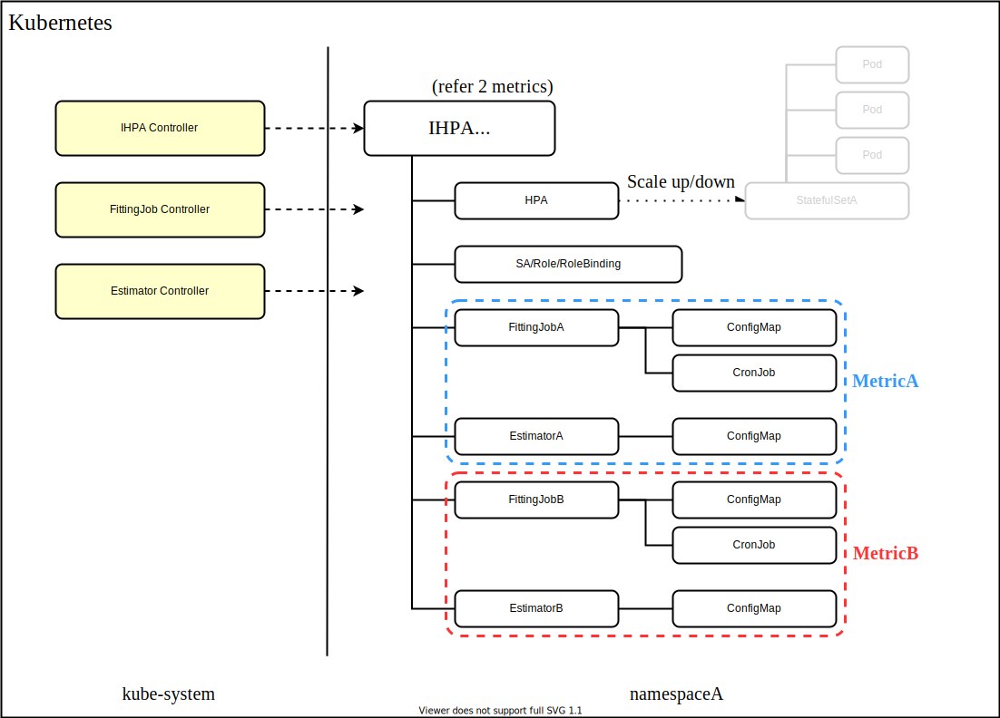
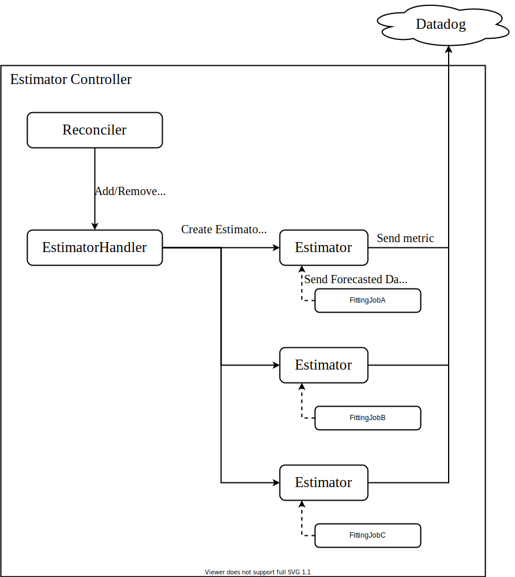
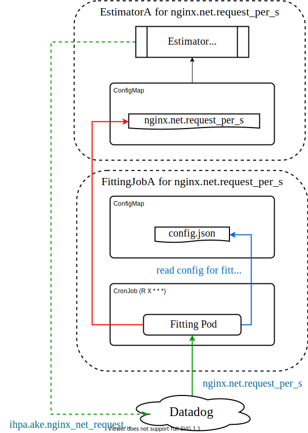

# Architecture

アーキテクチャについて説明します。

IHPA のリソースは Kubernetes 上に下記のように展開されます。各種 Namespace に散らばる IntelligentHorizontalPodAutoscaler (以後 IHPA) リソース、FittingJob リソース、Estimator リソースを各 Controller が管理します。IHPA リソースからは HorizontalPodAutoscaler, FittingJob, Estimator, RBAC 系リソースが生成されます。HPA には実際に指定したメトリクスのエントリに加えて、予測用に使用されるメトリクスのエントリが注入されます。また、FittingJob と Estimator は 1 つの組になっており、HPA の設定として指定されたメトリクスの数だけ作られます。FittingJob からは学習ジョブを実行するための CronJob とその設定ファイルである ConfigMap が生成されます。Estimator からはデータを受け取るための ConfigMap が生成されます。FittingJob にはこの ConfigMap の名前が渡され、そこに対して予測結果を書き込みます。予測部分は Controller の世界から外れて CronJob で行われるため、そこでの ConfigMap へのアクセスのために RBAC リソースが作られています。



IHPA のマニフェストは次のように HPA を内包した設計になっています。ユーザーは予測メトリクスについて考える必要はなく、HPA を設定するのと同じように設定します。この例は Deployment nginx に対して次の 2 点を保証する設定です。

- 平均 CPU 使用率が requests の 50% 以下になる
- 平均秒間リクエスト数が 10 以下になる
    - External メトリクスは `matchLabels` で適切に対象を絞るようにしてください

<details>
<summary>IHPA のマニフェスト (click to open)</summary>

```yaml
---
apiVersion: ihpa.ake.cyberagent.co.jp/v1beta1
kind: IntelligentHorizontalPodAutoscaler
metadata:
  name: nginx
spec:
  metricProvider:
    name: datadog
    datadog:
      apikey: xxx
      appkey: yyy
  template:
    spec:
      scaleTargetRef:
        apiVersion: apps/v1
        kind: Deployment
        name: nginx
      minReplicas: 1
      maxReplicas: 5
      metrics:
      - type: Resource
        resource:
          name: cpu
          target:
            type: Utilization
            averageUtilization: 50
      - type: External
        external:
          metric:
            name: nginx.net.request_per_s
            selector:
              matchLabels:
                kube_namespace: loadtest
                kube_deployment: nginx
                kube_container_name: nginx
```

</details>

この IHPA リソースは次のような HPA リソースを作ります。IHPA に指定した 2 つのメトリクスの下に新たに 2 つの予測メトリクスが追加されていることがわかります。このように予測メトリクスは指定されたメトリクス名に対応した名前で MetricProvider (Datadog や Prometheus) に送られます。対応名は基本的に `ake.ihpa.forecasted_` という接頭辞をつけたものになりますが、Resource タイプなどの特殊なものはプロバイダに応じた名前に変換された上でこの接頭辞が付与されます。以上により将来の負荷に合わせたスケーリングを行うことができます。もし予測が外れたとしても元のメトリクスが対象に入っているため、負荷が高いのにレプリカを減らされることはありません。

<details>
<summary>HPA のマニフェスト (click to open)</summary>

```yaml
---
apiVersion: autoscaling/v2beta2
kind: HorizontalPodAutoscaler
metadata:
  name: nginx
  namespace: default
spec:
  scaleTargetRef:
    apiVersion: apps/v1
    kind: Deployment
    name: nginx
  minReplicas: 1
  maxReplicas: 5
  metrics:
  - type: Resource
    resource:
      name: cpu
      target:
        type: Utilization
        averageUtilization: 50
  - type: External
    external:
      metric:
        name: nginx.net.request_per_s
        selector:
          matchLabels:
            kube_namespace: default
            kube_deployment: nginx
            kube_container_name: nginx
      target:
        type: AverageValue
        averageValue: "10"
  - type: External
    external:
      metric:
        name: ake.ihpa.forecasted_kubernetes_cpu_usage_total
        selector:
          matchLabels:
            kube_system_uid: 9833e04f-a689-47f9-b588-36a616432abd
            kube_namespace: default
            kube_deployment: nginx
      target:
        type: AverageValue
        averageValue: "50M"
  - type: External
    external:
      metric:
        name: ake.ihpa.nginx_net_request_per_s
        selector:
          matchLabels:
            kube_system_uid: 9833e04f-a689-47f9-b588-36a616432abd
            kube_namespace: default
            kube_deployment: nginx
      target:
        type: AverageValue
        averageValue: "10"
```

</details>

少し内部的な話をするとラベルは完全な一意性を担保するために、指定されたラベルをコピーせずに IHPA 側で生成しています (Kubernetes クラスタの判別のために kube-system の UID を使っています)。また、Resource タイプは少し特殊で、External には Utilization という概念がない (min/max がわからないのでそうなります) ため、ターゲットのすべてのコンテナが持つ requests を計算して指定された Utilization に相当する値を設定しています。

次にどのようにメトリクスが MetricProvider に送られるかを見ていきましょう。メトリクスの送信は EstimatorController が担当しています。この図はその Controller の流れを表したものです。スタートに位置する Reconciler は Estimator リソースを作ったり消したりするコンポーネントで Custom Controller の中枢的存在です。そのリソースが作成されると EstimatorHandler を通して Estimator という goroutine を生成します。EstimatorHandler は API 的にリクエストを受け付ける Channel の口を持っており、これを介して処理を行います。これによって作られた Estimator goroutine が ConfigMap を監視し、そこにデータが書き込まれると MetricProvider に送ります。厳密にはまとまったデータを読み込み、そのデータポイントの時刻になったら送信しています。これは Datadog において 10 分先のメトリクスしか送れないという制約への対処です。



最後に FittingJob がどのように予測メトリクスを書き込み、Estimator が受け取っているかについて説明します。FittingJob は前述のとおり ConfigMap と CronJob によって構成されています。CronJob は学習用のイメージを実行するジョブであり、このイメージは学習データとなるメトリクスの収集・モデル訓練・直近 1 週間の予測メトリクスの出力を行います。このジョブは毎日任意の時刻のランダム分に実行されます。ランダム分としているのはジョブの同時実行によるパフォーマンスの低下を避けるためです。FittingJob によって作られる ConfigMap は学習ジョブが使用する設定ファイルのみを格納しており、予測メトリクスは Estimator によって作られる ConfigMap に保存するようになっています。Estimator の ConfigMap の CRUD 操作は監視されており、変更を検知すると Estimator goroutine にそのデータを渡すようになっています。


